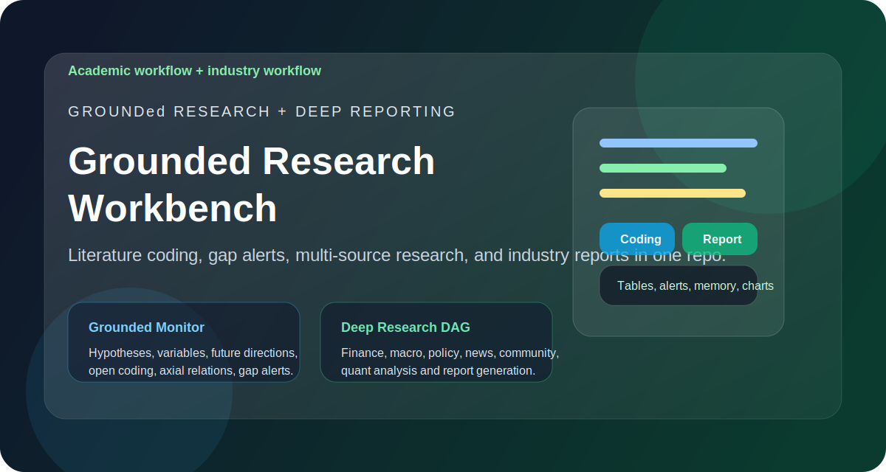
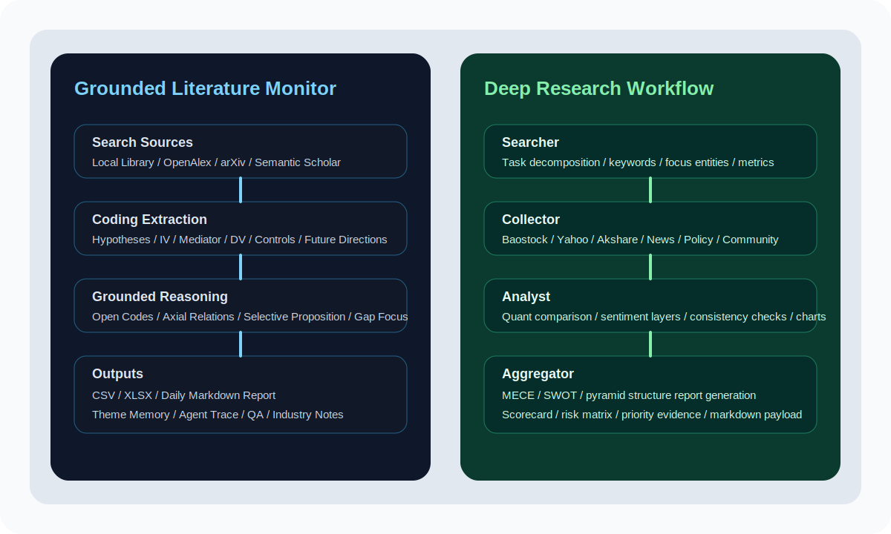
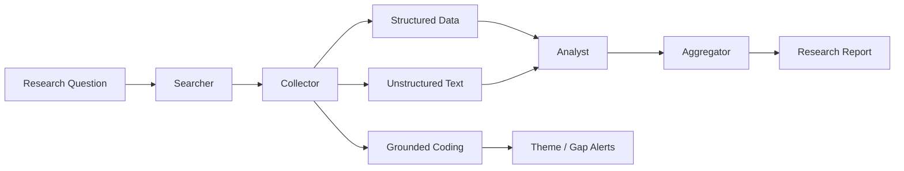

# Grounded Research Workbench



一个把“扎根理论文献编码”和“行业深度研究报告”放进同一套研究工作台里的仓库。

这个项目适合两类工作同时推进：

- 学术研究：每天追踪新文献，抽取研究假设、理论命题、变量角色与未来研究方向，形成可继续写论文的编码表。
- 行业研究：把财务、行情、新闻、政策、社区讨论接到同一条工作流里，生成结构化行业报告。

## 为什么做这个仓库

很多研究流程都卡在同一个问题上：搜集、整理、编码、比较、写作被切成了很多零散动作。这个仓库把这些动作重新组织成两条可复用的主线：

1. `grounded_daily_monitor.py`
   面向扎根理论和文献综述写作，重点是“文献追踪 + 编码 + 缺口提醒”。
2. `deep_research_workflow.py`
   面向行业报告和公司研究，重点是“多源采集 + 定性定量分析 + 报告生成”。

## 你可以得到什么

- 每日新增文献表：题目、作者、年份、摘要、主题、来源一张表整理好。
- 扎根编码结果：研究假设、理论命题、自变量、中介/调节变量、因变量、控制变量、未来研究方向与初级编码。
- 研究缺口提醒：识别你论文里还没覆盖的新主题、新变量关系链、新命题方向。
- 专业报告输出：自动组织成 MECE、SWOT、金字塔结构的行业研究报告。
- 可追溯流程：运行状态、搜索历史、下载历史、记忆文件、agent trace 都会保留下来。

## 安装与运行

### 1. 本地命令行运行

```bash
git clone https://github.com/lujie2322/grounded-research-workbench.git
cd grounded-research-workbench
python3 -m venv .venv
source .venv/bin/activate
pip install -r requirements.txt
```

然后你可以直接运行两条主线：

```bash
python3 grounded_daily_monitor.py --config config/grounded_monitor.example.json
python3 deep_research_workflow.py --config config/deep_research_workflow.example.json --task "比较腾讯、苹果和特斯拉在平台生态与资本市场表现上的差异"
```

### 2. 网页界面运行

这个仓库现在已经自带中文网页界面，适合老师、同学或非开发者直接使用：

```bash
python3 -m streamlit run streamlit_app.py
```

启动后你可以在网页里完成：

- 上传论文或 PDF
- 输入研究主题词
- 运行扎根文献监测
- 基于文献库提问
- 一键生成行业报告
- 生成多智能体深度研究报告

### 3. Docker 运行

如果你希望别人不用自己配环境，可以直接用 Docker：

```bash
docker build -t grounded-research-workbench .
docker run --rm -p 8501:8501 grounded-research-workbench
```

然后浏览器打开：

```text
http://localhost:8501
```

## 发布友好特性

这个仓库已经补上了适合公开发布的基础设施：

- `requirements.txt`：统一 Python 依赖
- `LICENSE`：MIT 开源许可证
- `Dockerfile`：一键打包网页版本
- `.github/workflows/ci.yml`：基础 CI，自动做依赖安装和脚本检查
- `streamlit_app.py`：中文网页入口
- `.streamlit/config.toml`：网页主题和服务配置

## 最推荐的使用方式

如果你是：

- 研究者或开发者：直接 `pip install -r requirements.txt`
- 想分享给老师、同学、团队成员：优先用 `python3 -m streamlit run streamlit_app.py`
- 想给更多人公开体验：把 Docker 版本部署到云端

## 如何让更多人真正用上

只把代码放在 GitHub 上还不够。更适合传播的方式是：

1. GitHub 仓库放源码、文档和示例配置
2. Streamlit 网页版提供实际入口
3. Docker 版本保证环境一致
4. 再把网页部署到云端，例如：
   - Streamlit Community Cloud
   - Hugging Face Spaces
   - Railway
   - Render

这样别人会有两种使用路径：

- 能写代码的人：直接 clone 仓库本地运行
- 不想配环境的人：直接打开在线网页使用

## 仓库结构



```text
.
├── grounded_daily_monitor.py
├── deep_research_workflow.py
├── deep_research/
│   ├── connectors.py
│   ├── workflow.py
│   ├── models.py
│   ├── memory.py
│   └── llm.py
├── config/
│   ├── grounded_monitor.example.json
│   └── deep_research_workflow.example.json
├── .github/workflows/
│   └── ci.yml
├── .streamlit/
│   └── config.toml
├── prompts/
│   └── grounded_monitor_prompts.md
├── streamlit_app.py
├── requirements.txt
├── Dockerfile
├── scripts/
└── README_grounded_monitor.md
```

## 两条核心主线

### 1. 扎根文献监测

适合“先系统梳理已有文献，再从研究假设/命题和未来研究方向中做编码”的论文写法。

当前已经支持：

- 多源检索：本地文献库、OpenAlex、arXiv、Semantic Scholar
- 字段抽取：标题、作者、年份、期刊、摘要、主题、来源
- 扎根式编码：
  - `hypotheses_propositions`
  - `independent_vars`
  - `mediator_moderator_vars`
  - `dependent_vars`
  - `control_vars`
  - `future_research_directions`
  - `future_direction_codes`
- 关系提炼：
  - `open_code_details`
  - `axial_relations`
  - `selective_proposition`
  - `novel_relations`
  - `gap_focus`
- 输出：
  - `literature_table.csv`
  - `literature_table.xlsx`
  - `daily_report_YYYY-MM-DD.md`

快速运行：

```bash
python3 grounded_daily_monitor.py \
  --config config/grounded_monitor.example.json
```

如果你想直接基于已有文献回答问题：

```bash
python3 grounded_daily_monitor.py \
  --config config/grounded_monitor.example.json \
  --skip-monitor \
  --ask "当前创业即兴行为研究中最常见的前因和边界条件是什么？"
```

详细说明见 [README_grounded_monitor.md](README_grounded_monitor.md)。

### 2. 行业深度研究工作流

适合一句话触发多源研究，最后落成一份完整、多章节、可追溯的研究报告。

当前已经支持：

- 五智能体 DAG：`Orchestrator / Searcher / Collector / Analyst / Aggregator`
- 数据源：
  - `Baostock` A 股行情与财务指标
  - `Yahoo Finance` 港股/美股行情与利润表摘要
  - `Akshare` 宏观、财务摘要、个股新闻
  - `Google 新闻 RSS`
  - `国务院政策库`
  - `东方财富股吧`
  - `Stocktwits`
- 报告能力：
  - 财务比对
  - 新闻舆情
  - 政策动向
  - 社区讨论
  - 一致性校验
  - 风险矩阵
  - 重点证据

快速运行：

```bash
python3 deep_research_workflow.py \
  --config config/deep_research_workflow.example.json \
  --task "比较腾讯、苹果和特斯拉在平台生态与资本市场表现上的差异" \
  --symbols "0700.HK,AAPL,TSLA" \
  --metrics "收盘价,区间涨跌幅,成交活跃度,市值,PE,ROE,净利率,营收,净利润" \
  --keywords "平台生态,AI,舆情,政策,社区讨论" \
  --output-name "hk_us_cross_market_compare"
```

详细说明见 [README_deep_research_workflow.md](README_deep_research_workflow.md)。

## 一张图看清工作流



## 典型输出

- 扎根监测输出
  - `literature_table.csv`
  - `literature_table.xlsx`
  - `daily_report_YYYY-MM-DD.md`
  - `theme_memory.json`
  - `agent_trace.jsonl`
- 深度研究输出
  - `*_report.md`
  - `*_payload.json`
  - `charts/`
  - `workflow_trace.jsonl`
  - `workflow_memory.json`

## 适用场景

- 想模仿“先系统搜文献，再从变量和未来研究方向做编码”的论文写法。
- 需要长期跟踪某个研究主题，持续发现新增文献和研究缺口。
- 想把“文献研究”和“行业报告”放在同一套可复用代码里。
- 需要一个可以继续扩展 API、skills、agent 和数据源的研究底座。

## 下一步建议

- 把你自己的论文文件填进 `baseline_paths`，让缺口提醒真正对齐你的论文内容。
- 配置 OpenAI 兼容 API，让问答、翻译、报告和自动编码更完整。
- 按你的研究方向继续扩展专用提示词、变量词典和行业模板。

## 相关文件

- 主文献监测脚本：[grounded_daily_monitor.py](grounded_daily_monitor.py)
- 深度研究入口：[deep_research_workflow.py](deep_research_workflow.py)
- 扎根监测文档：[README_grounded_monitor.md](README_grounded_monitor.md)
- 行业研究文档：[README_deep_research_workflow.md](README_deep_research_workflow.md)
- 扎根提示词：[prompts/grounded_monitor_prompts.md](prompts/grounded_monitor_prompts.md)
