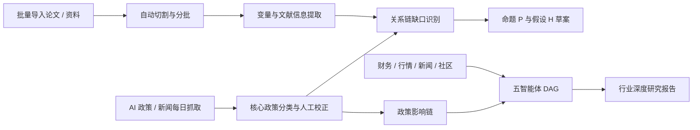

# Grounded Research Workbench


一个面向学术研究、政策跟踪和行业报告生成的中文研究工作台。

它把三类原本分散的任务放在同一个网页里：

- `文献自动化编码`：批量导入论文，自动切分、提取变量、生成命题与假设草案。
- `人工智能政策汇总`：每日抓取中国人工智能相关政策与新闻，做核心政策分类、人工校正和政策-论文缺口分析。
- `行业深度研究报告`：融合财务、行情、新闻、政策、社区讨论和本地资料，生成结构化、多章节、可追溯的行业报告。

## 当前亮点

| 能力 | 说明 |
|:---|:---|
| 文献批量导入 | 支持桌面文件夹、手动路径和网页上传，自动按文件数、页数和体积切成多个批次。 |
| 论文编码表 | 提取题目、作者、期刊、年份、样本、方法、理论基础、变量角色、未来研究方向。 |
| 变量关系链 | 从政策和文献中识别 `前因变量 -> 机制/调节变量 -> 结果变量`。 |
| 命题与假设草案 | 自动把政策-论文缺口转成 `研究命题 P1/P2` 和 `研究假设 H1/H2`。 |
| AI 政策库 | 抓取中国政府网、国务院政策库、国家网信办等来源，区分核心政策、全部政策、新闻解读。 |
| 人工校正面板 | 支持批量修改政策分类、核心政策标记、发布机构和条目类型。 |
| 政策影响链 | 行业报告会自动写入 `政策信号 -> 组织机制 -> 业务结果` 的政策影响链章节。 |
| 多智能体报告 | `Orchestrator / Searcher / Collector / Analyst / Aggregator` 五智能体 DAG 生成研究报告。 |

## 适合谁使用

- 正在写文献综述、扎根理论、变量编码、研究假设整理的研究者。
- 需要持续跟踪人工智能政策、监管变化和产业政策的人。
- 想把论文资料、政策资料和行业研究统一管理的学生、老师或团队。
- 需要一键生成行业报告、政策影响分析、公司对比材料的人。

## 网页界面

启动后，左侧会看到主要功能入口：

- `人工智能政策汇总`
- `文献自动化编码`
- `论文编码工作台`
- `元分析工作台`
- `资料 / 访谈编码工作台`
- `行业深度研究报告`

其中 `文献自动化编码` 是三步式流程：

1. `文献信息提取`
2. `编码深化分析`
3. `结果汇总输出`

`人工智能政策汇总` 会提供：

- 核心政策
- 全部政策
- 每日抓取预览
- 人工校正
- 政策与论文联动提醒
- 政策-论文缺口分析表
- 政策驱动研究命题草案
- 政策驱动研究假设草案

## 快速开始

### 1. 克隆仓库

```bash
git clone https://github.com/lujie2322/grounded-research-workbench.git
cd grounded-research-workbench
```

### 2. 创建环境并安装依赖

```bash
python3 -m venv .venv
source .venv/bin/activate
pip install -r requirements.txt
```

### 3. 打开中文网页

```bash
python3 -m streamlit run streamlit_app.py
```

然后在浏览器打开：

```text
http://localhost:8501
```

### 4. Docker 运行

```bash
docker build -t grounded-research-workbench .
docker run --rm -p 8501:8501 grounded-research-workbench
```

## 命令行用法

### 文献监测与编码

```bash
python3 grounded_daily_monitor.py \
  --config config/grounded_monitor.example.json
```

基于已有文献库问答：

```bash
python3 grounded_daily_monitor.py \
  --config config/grounded_monitor.example.json \
  --skip-monitor \
  --ask "当前创业即兴行为研究中最常见的前因和边界条件是什么？"
```

### 行业深度研究报告

```bash
python3 deep_research_workflow.py \
  --config config/deep_research_workflow.example.json \
  --task "比较腾讯、苹果和特斯拉在平台生态与资本市场表现上的差异" \
  --symbols "0700.HK,AAPL,TSLA" \
  --metrics "收盘价,区间涨跌幅,成交活跃度,市值,PE,ROE,净利率,营收,净利润" \
  --keywords "平台生态,AI,舆情,政策,社区讨论" \
  --output-name "hk_us_cross_market_compare"
```

### AI 政策抓取

```bash
python3 policy_digest_fetcher.py \
  --outdir output/policy_digest
```

## 工作流总览




## 输出文件

### 文献自动化编码

- `paper_stage1_table.csv`
- `paper_stage1_table.xlsx`
- `batch_manifest.json`
- `inventory.csv`
- `grounded_output/literature_table.xlsx`

### 政策汇总与论文联动

- `output/policy_digest/latest/core_policies.json`
- `output/policy_digest/latest/all_policies.json`
- `output/policy_digest/latest/news_updates.json`
- `output/policy_digest/latest/policy_paper_gap_analysis.xlsx`
- `output/policy_digest/latest/policy_proposition_drafts.xlsx`
- `output/policy_digest/latest/policy_hypothesis_drafts.xlsx`
- `output/policy_digest/policy_overrides.json`

### 行业深度研究报告

- `*_report.md`
- `*_payload.json`
- `charts/`
- `workflow_trace.jsonl`
- `workflow_memory.json`

## 项目结构

```text
.
├── streamlit_app.py                  # 中文网页入口
├── research_batching.py              # 批量导入、扫描、切割与分批
├── grounded_daily_monitor.py         # 文献监测、编码、问答与报告
├── policy_digest_fetcher.py          # AI 政策与新闻抓取
├── deep_research_workflow.py         # 行业深度研究 CLI
├── deep_research/
│   ├── connectors.py                 # 财务、新闻、政策、社区和本地资料连接器
│   ├── workflow.py                   # 五智能体 DAG 工作流
│   ├── models.py                     # 数据模型
│   ├── memory.py                     # 工作流记忆
│   └── llm.py                        # OpenAI 兼容 API 调用
├── config/
│   ├── grounded_monitor.example.json
│   └── deep_research_workflow.example.json
├── prompts/
│   └── grounded_monitor_prompts.md
├── assets/
│   ├── readme-hero.svg
│   └── readme-workflows.svg
├── requirements.txt
├── Dockerfile
├── LICENSE
└── .github/workflows/ci.yml
```

## 数据源

当前已接入或预留的来源包括：

- 本地 PDF / Word / CSV / Excel / Markdown
- OpenAlex
- arXiv
- Semantic Scholar
- 中国政府网
- 国务院政策库
- 国家网信办
- Baostock
- Yahoo Finance
- Akshare
- Google News RSS
- 东方财富股吧
- Stocktwits

## API 配置

部分自动分析、问答、翻译和报告增强能力支持 OpenAI 兼容 API。你可以在配置文件中填写：

- `api_url`
- `model`
- `api_key_env`

然后在本地环境变量里放入对应 key。没有配置 API 时，软件仍会使用规则和模板生成基础结果。

## 许可证

本项目使用 MIT License。你可以自由使用、修改和二次开发，但请自行核验外部数据源的使用条款和抓取频率要求。

## 当前定位

这个仓库不是单一的“文献搜索工具”，而是一个正在逐步完善的中文研究自动化工作台。

它的核心目标是：

- 让论文编码不再手工重复劳动。
- 让政策变化可以自动进入研究框架。
- 让行业报告有真实数据、真实来源和可追溯链路。
